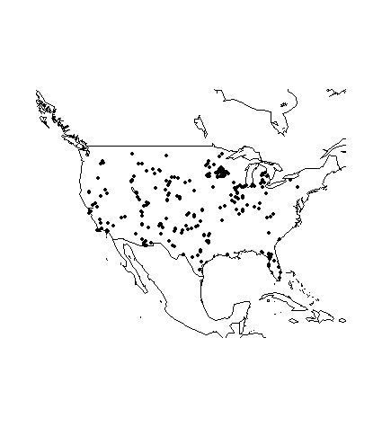
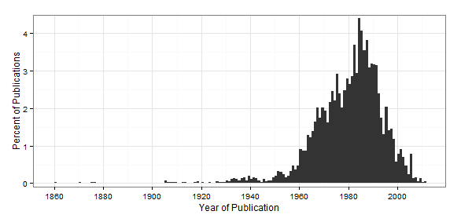

neotoma
========

The `neotoma` package is a programmatic R interface to the [Neotoma Paleoecological Database](http://www.neotomadb.org/). The package is intended to both allow users to search for sites and to download data for use in analyical workflows of paleoecological research.

`neotoma` is part of the [rOpenSci](http://ropensci.org) project and is also hosted on [Figshare](http://dx.doi.org/10.6084/m9.figshare.677131)

### Development by
[Simon Goring](http://downwithtime.wordpress.com) - University of Wisconsin-Madison, Department of Geography

Package functions resolve various Neotoma APIs and re-form the data returned by the Neotoma database into R data objects.  The format of the Neotoma data, and the actual API functions can be accessed on the Neotoma API [website](http://api.neotomadb.org/doc/resources/home).

### Currently implemented in `neotoma`
+ compile_list - using established pollen-related taxonomies from the literature, take the published taxon list and standardize it to allow cross site analysis.
+ get_contacts - find contact information for data contributors to Neotoma. [API](http://api.neotomadb.org/doc/resources/contacts)
+ get_datasets - obtain dataset metadata from Neotoma. [API](http://api.neotomadb.org/doc/resources/datasets)
+ get_download - obtain full datasets (pollen or mammal) from Neotoma. [API](http://api.neotomadb.org/doc/resources/downloads)
+ get_publication - obtain publication information from Neotoma. [API](http://api.neotomadb.org/doc/resources/publications)
+ get_sites - obtain information on sites in the Neotoma dataset (which may contain multiple datasets). [API](http://api.neotomadb.org/doc/resources/sites)
+ get_table - return matrices corresponding to one of the Neotoma database tables. [tables](http://api.neotomadb.org/doc/resources/dbtables)
+ get_taxa - Get taxon information from Neotoma. [API](http://api.neotomadb.org/doc/resources/taxa)

### Coming soon
+ A broader set of taxonomies for use with datasets, including geography based taxonomies.
+ Functions to turn single-site datasets into multi-site datasets.
+ Age-modelling capabilities.

### Install `neotoma` 

+ Development version from GitHub:

```R 
install.packages("devtools")
require(devtools)
install_github("neotoma", "ropensci")
require(neotoma)
```

### A few examples

#### Find the distribution of sites with Mammoth fossils in Neotoma

```R
#  Example requires the plyr package and the mapdata package:
> require(plyr)
> test <- get_datasets(taxonname='Mammuthus*')
The API call was successful, you have returned  3273 records.
> site.locs <- ldply(test, function(x)x$Site)
> map('world', xlim=range(site.locs$LongitudeWest)+c(-10, 10), ylim=range(site.locs$LatitudeNorth)+c(-10, 10))
> points(site.locs$LongitudeWest, site.locs$LatitudeNorth, pch=19, cex=0.5)

```


### Plot the proportion of publications per year for datasets in Neotoma

```R
> # Requires ggplot2
> library(ggplot2)
> pubs <- get_publication()
The API call was successful, you have returned  3693 records.
Warning message:
In getForm(base.uri, .params = cl) : No inputs passed to form
> pub.years <- as.numeric(as.character(pubs$Year))
Warning message:
NAs introduced by coercion
> ggplot(data=data.frame(x = pub.years), aes(x)) +
+     stat_bin(aes(y=..density..*100, position='dodge'), binwidth=1) +
+     theme_bw() +
+     ylab('Percent of Publications') +
+     xlab('Year of Publication') +
+     scale_y_continuous(expand = c(0, 0.1)) +
+     scale_x_continuous(breaks = seq(min(pub.years, na.rm=TRUE), 2013, by=20))

```


