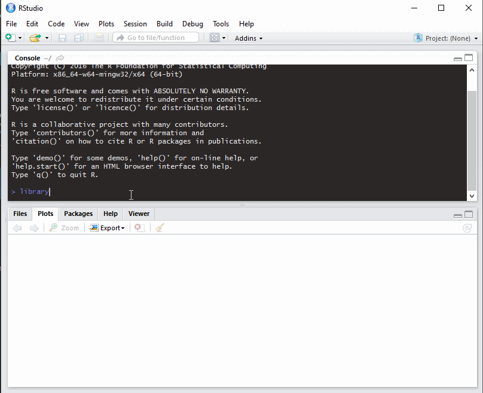

neotoma
========

[](https://travis-ci.org/ropensci/neotoma)
[](https://ci.appveyor.com/project/sckott/neotoma/branch/master)
[](https://codecov.io/github/ropensci/neotoma?branch=master)
[](https://github.com/metacran/cranlogs.app)
[](https://cran.r-project.org/package=neotoma)

The `neotoma` package is a programmatic R interface to the [Neotoma Paleoecological Database](http://www.neotomadb.org/). The package is intended to both allow users to search for sites and to download data for use in analyical workflows of paleoecological research.

`neotoma` is part of the [rOpenSci](http://ropensci.org) project and is also hosted on [Figshare](http://dx.doi.org/10.6084/m9.figshare.677131).  The `neotoma` package is also available on [CRAN](https://cran.r-project.org/package=neotoma) as of May 3, 2015.

For more information on the package please refer to: 

Goring, S., Dawson, A., Simpson, G. L., Ram, K., Graham, R. W., Grimm, E. C., & Williams, J. W.. (2015). neotoma: A Programmatic Interface to the Neotoma Paleoecological Database. *Open Quaternary*, 1(1), Art. 2. DOI: [10.5334/oq.ab](http://doi.org/10.5334/oq.ab)

### Development

*We welcome contributions from any individual, whether code, documentation, or issue tracking.  All participants are expected to follow the [code of conduct](https://github.com/ROpensci/neotoma/blob/master/code_of_conduct.md) for this project.*

+ [Simon Goring](http://downwithtime.wordpress.com) - University of Wisconsin-Madison, Department of Geography

### Contributors
+ [Gavin Simpson](http://www.fromthebottomoftheheap.net/) - University of Regina, Department of Biology
+ [Jeremiah Marsicek](http://geoweb.uwyo.edu/ggstudent/jmarsice/Site/Home.html) - University of Wyoming, Department of Geology and Geophysics
+ [Karthik Ram](http://nature.berkeley.edu/~kram/) - University of California - Berkely, Berkeley Institue for Data Science.
+ [Luke Sosalla](https://github.com/sosalla) - University of Wisconsin, Department of Geography

Package functions resolve various Neotoma APIs and re-form the data returned by the Neotoma database into R data objects.  The format of the Neotoma data, and the actual API functions can be accessed on the Neotoma API [website](http://api.neotomadb.org/doc/resources/home).

If you have used the package please consider providing us feedback through a [short survey](https://docs.google.com/forms/d/e/1FAIpQLSdRNat6L9grRF0xU5gibkr26xq9jD9wyHgw_AWxhrgn0lWv7w/viewform).

### Install `neotoma`

+ CRAN:
```r
install.packages('neotoma')
```

+ Development version from GitHub:
```r
install.packages("devtools")
library(devtools)
install_github("ropensci/neotoma")
library(neotoma)
```

### Currently implemented in `neotoma`

More functions are available through the package help.  These represent the core functions:

+ `get_site` - obtain information on sites in the Neotoma dataset (which may contain multiple datasets). [API](http://api.neotomadb.org/doc/resources/sites)
+ `get_dataset` - obtain dataset metadata from Neotoma. [API](http://api.neotomadb.org/doc/resources/datasets)
+ `get_download` - obtain full datasets (pollen or mammal) from Neotoma. [API](http://api.neotomadb.org/doc/resources/downloads)
+ `compile_list` - using established pollen-related taxonomies from the literature, take the published taxon list and standardize it to allow cross site analysis.
+ `get_contact` - find contact information for data contributors to Neotoma. [API](http://api.neotomadb.org/doc/resources/contacts)
+ `get_publication` - obtain publication information from Neotoma. [API](http://api.neotomadb.org/doc/resources/publications)
+ `get_table` - return matrices corresponding to one of the Neotoma database tables. [tables](http://api.neotomadb.org/doc/resources/dbtables)
+ `get_taxa` - Get taxon information from Neotoma. [API](http://api.neotomadb.org/doc/resources/taxa)
+ `get_chroncontrol` - Get chronological information used to build the age-depth model for the record. [API](http://api.neotomadb.org/doc/resources/chroncontrol)

### Recent Changes
+ 1.7.4: Bug fix: `get_dataset(gpid=123)` was returning an error, fix corrects the error to allow unassigned `x` variables.  Updated the allowable dataset types for searching to reflect the larger set of dataset types within Neotoma.
+ 1.7.3: Added numeric/integer methods to the `get_site()` and `get_dataset()` functions so that a vector of dataset or siteids can be passed to improve more general workflow methods.
+ 1.7.2: Bugfixes, added the `taxa()` function to easily extract taxa from one or multiple download objects.
+ 1.7.1: Bugfix for `compile_download()`, single sample downloads were failing to compile properly, added the `taxa()` function to extract taxa lists from large download objects.
+ 1.7.0: Added `plot_leaflet()` to allow interactive exploration of downloaded Neotoma data.  Integrates with the Neotoma Explorer.  Minor bugfix for `get_download()` to allow records to be sent to Neotoma and to be filtered.
+ 1.6.2: Improved the basic `plot()` method based on tests against Tilia files in the Neotoma Holding Tank & built more robust interpolation in `read_bacon()` so that age models without interpolated dates can still be imported. `browse()` now opens multiple datastes in the Neotoma Explorer at once.
+ 1.6.1: New `Stratiplot()` method, using the `analogue` package to plot dataset diagrams from `download` and `download_list` objects, bug fixes for `write_agefile()` and a new function, `read_bacon()`, to read in and integrate Bacon chronologies into `download` objects.
+ 1.6.0: Support for vector inputs in the `gpid` selection. Added a `get_closest()` function to find the closest sample site. Mostly clean-up of reported bugs by users. Revised examples for faster check speed.
+ 1.5.1: Minor fix to the `get_dataset()` for site level data to account for some datasets with empty submission data.  Some style changes to code (non-functional changes)
+ 1.5.0: More extensive testing to support multiple dataset types.  Water chemistry datasets still unsupported. Function `read.tilia()` added to read Tilia (http://tiliait.com) style XML files. Moved to using `xml2`, `httr` and `jsonlite` to support parsing.
+ 1.4.1: Small changes to `get_geochron()` to address bug reports and improve object `print` methods.
+ 1.4.0: Added `plot()` method for datasets, sites & downloads.  Fixed a bug with records missing chronologies.

### A few examples:

#### Find the distribution of sites with Mammoth fossils in Neotoma

```r
#  Example requires the mapdata package:
library('mapdata')

#  You may use either '%' or '*' as wildcards for search terms:
test <- get_dataset(taxonname='Mammuthus*')

The API call was successful, you have returned  3273 records.

site.locs <- get_site(test)

# A crude way of making the oceans blue.
plot(1, type = 'n',
     xlim=range(site.locs$long)+c(-10, 10),
     ylim=range(site.locs$lat)+c(-10, 10),
     xlab='Longitude', ylab = 'Latitude')
rect(par("usr")[1],par("usr")[3],par("usr")[2],par("usr")[4],col = "lightblue")
map('world',
    interior=TRUE,
    fill=TRUE,
    col='gray',
    xlim=range(site.locs$long)+c(-10, 10),
    ylim=range(site.locs$lat)+c(-10, 10),
    add=TRUE)

points(site.locs$long, site.locs$lat, pch=19, cex=0.5, col='red')

```


#### Plot the proportion of publications per year for datasets in Neotoma

```R
# Requires ggplot2
library('ggplot2')
library('plyr')
pubs <- get_publication()

pub.years <- ldply(pubs, "[[", "meta")

ggplot(data=pub.years, aes(x = year)) +
     stat_bin(aes(y=..density..*100, position='dodge'), binwidth=1) +
     theme_bw() +
     ylab('Percent of Publications') +
     xlab('Year of Publication') +
     scale_y_continuous(expand = c(0, 0.1)) +
     scale_x_continuous(breaks = seq(min(pub.years$year, na.rm=TRUE), 2014, by=20))

```


#### Cumulative plot of record uploads to Neotoma since 1998.

Found at [this gist](https://gist.github.com/SimonGoring/718a654f304f2d16ce4b)


#### Obtain records & Rebuild Chronologies with Bacon

Found at [this gist](https://gist.github.com/SimonGoring/877dd71cc3ad6bf8531e).  Prepared in part for a Bacon (Blaauw & Christen, 2011) workshop at the 2015 International Limnogeology Conference in Reno-Tahoe, Nevada led by Amy Myrbo (University of Minnesota).

#### Simple paleo-data visualization

Simple paleo-data visualization in R, linking the `rioja`, `neotoma` and `dplyr` packages.  Found at [this gist](https://gist.github.com/SimonGoring/dbb4c8e0087882dc143baa89fa041d2b).



#### Find all site elevations in California:

Found at [Simon Goring's gist.](https://gist.github.com/SimonGoring/6a2ba1d55a3a7f78723b37e896b55b70).

#### Match all Neotoma taxa to external databases using `taxize`:

Found at [Simon Goring's gist.](https://gist.github.com/SimonGoring/24fb1228204f768f3f0020f37060db18).

#### Other Resources Using `neotoma`

*  [A simple `neotoma` workshop](http://www.goring.org/resources/Neotoma_Lesson.html)
*  [Data exploration and chronologies with `neotoma`](http://www.goring.org/resources/neotoma_lab_meeting.html)

### `neotoma` Workshops

We have provided a set of educational tools through the [NeotomaDB](http://github.com/neotomaDB) GitHub repository in the [Workshops](http://github.com/NeotomaDB/Workshops) repository.  These are free to share, and can be modified as needed.
